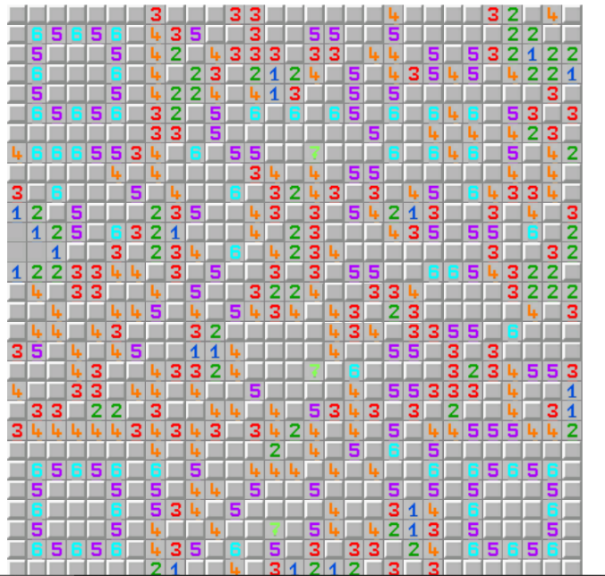
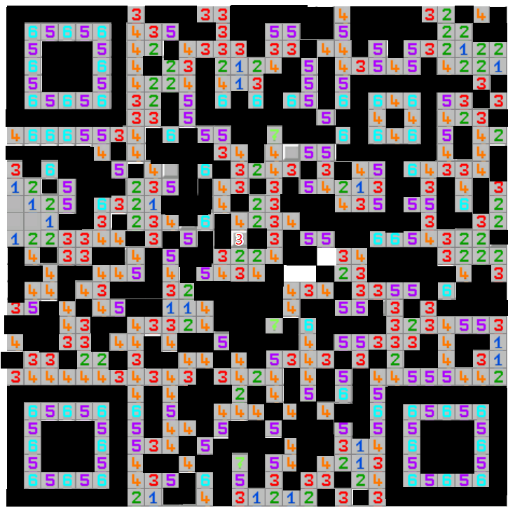

# Mine Sweeping

## Problem description

enjoy the game :)

## Solution

Unzip the compressed zip, you will find a `Mine Sweeping.exe` built with Unity. Click & run it, you will find a Mine Sweeping game on your screen (just as its name suggests).

A dirty yet useful solution is to play the Mine Sweeping game manually. It is worth noticing that the game will not refresh after each failure, i.e. the position of mines are fixed and won't change. Hence, you can use tools like Snipaste to record the location of mines, thus avoiding make the same mistake again.

The result is 

Then, it is clear that the image is a QR code. However, scanner won't recognize it as-is. So I did a little extra work and made the following QR code.

After scanning the code, you will get a URL `http://qr02.cn/FeJ7dU`

Visit the site, you can get the flag
`de1ctf{G3t_F1@g_AFt3R_Sw3ep1ng_M1n3s}`
